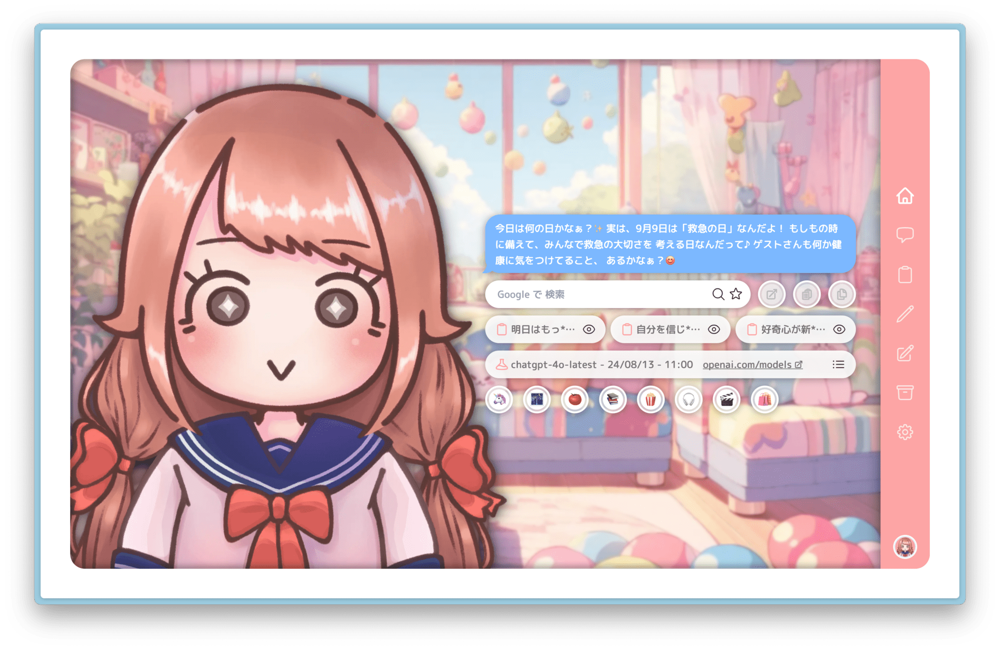
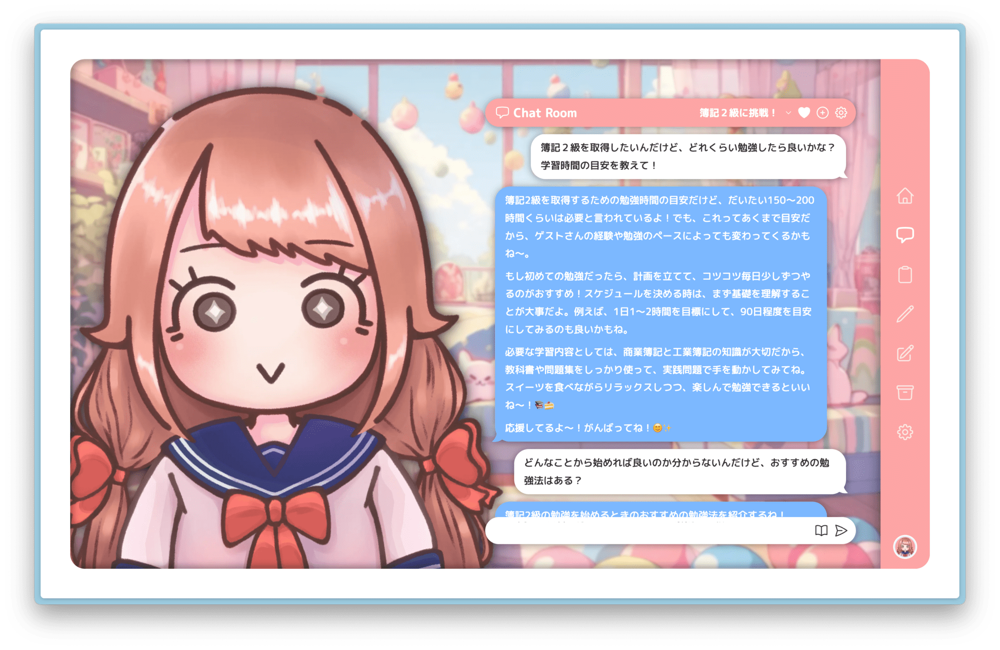
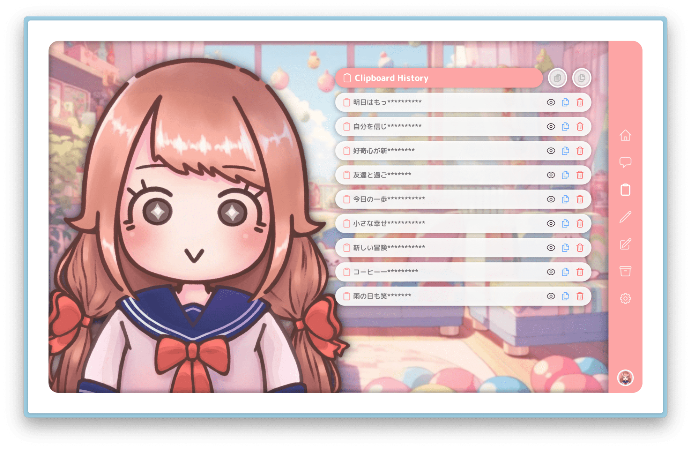
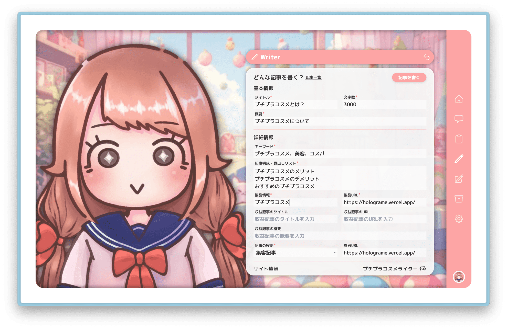
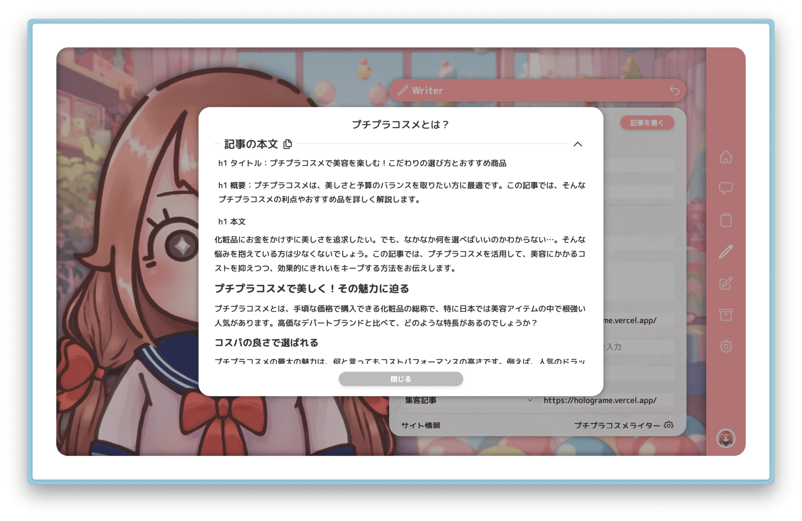
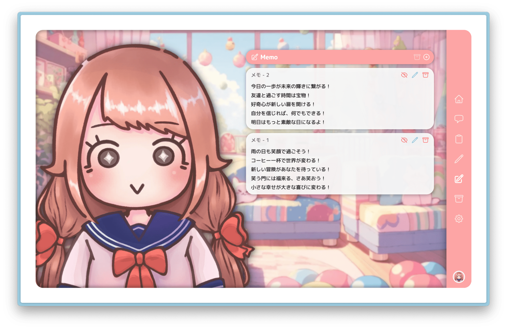
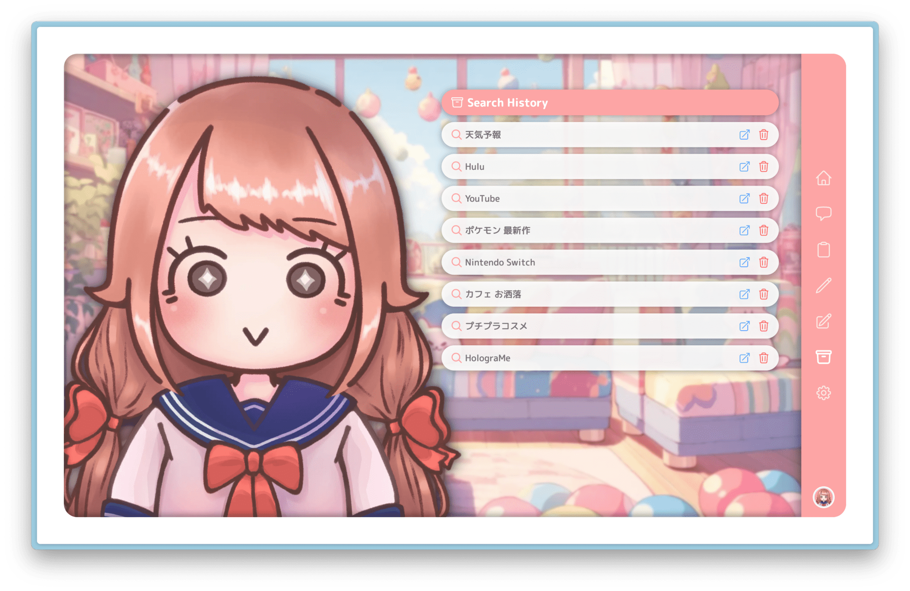
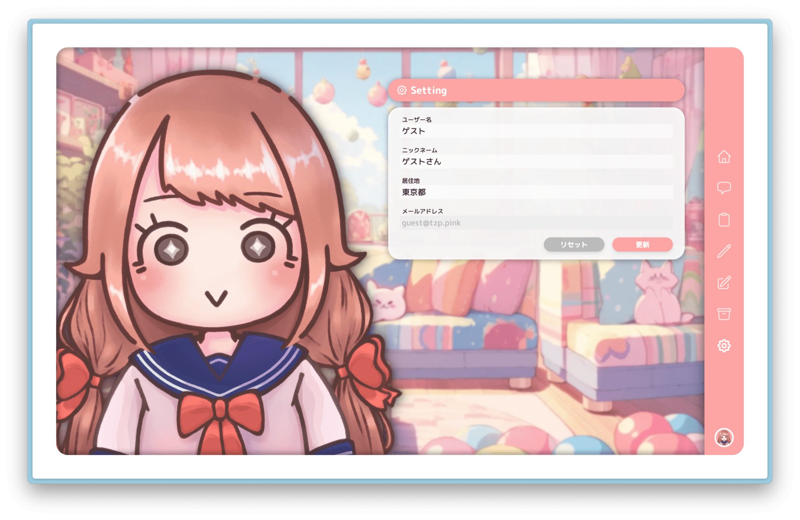

# 🦄 HolograMe（ホログラム）

### 最適化されたスタートページを提供するアプリケーション

→ 最終ゴールは全てをこのアプリケーション上で完了できることを目標にしています。

### 今後追加したい機能

- タスク管理機能
- Google カレンダー連携機能
- 翻訳機能
- その他 ……

## プロダクトに関する注意事項

- ※このレポジトリは通常時は Private で運用しています。
- ※設計等は行わずひたすらリリースを繰り返しているため、
  - Issue、PR、ブランチ、ディレクトリ構成の運用等は別レポジトリをご参照ください 🙇  
    　 → [GitHub：linkloom](https://github.com/tzptzptzptzptzp/linkloom)
- ※継続的に開発を続けているので、アクセスするタイミングによっては  
  バグが発生している可能性もあります。予めご了承願います。

## ホーム

- ひとこと機能
- 検索機能
- お気に入り登録機能
- OpenAI API のモデル一覧機能

## チャット

- チャット機能
- チャットルーム機能
  - ルーム設定
  - お気に入りルーム設定機能（ブラウザ単位）
  - デフォルトメッセージ設定機能
- 定型文呼び出し機能

## クリップボード共有機能

- 文章共有機能（アカウント単位）

## ライター機能

- ライター登録機能
- 記事ライティング機能

## メモ機能

- メモ機能
- メモアーカイブ機能

## 検索履歴保存機能

- 検索履歴保存機能（ブラウザ単位）

## ユーザー情報保存機能

- ユーザー情報保存機能（アカウント単位）

## ゲストログイン情報

※ レポジトリが Public の時のみログイン可能です

ユーザー ID：`guest@tzp.pink`  
パスワード：`oK27#^yWZjYoPz`

ログインページ：[holograme.vercel.app/auth](https://holograme.vercel.app/auth)
